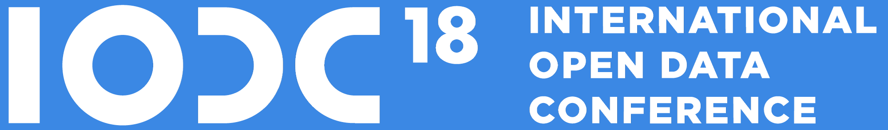

# IODC 2018: Data Standards Day

**Open Data Standards Day 2018** takes place on 26th September 2018, ahead of the [International Open Data Conference](http://www.opendatacon.org) in Buenos Aires.

If you are working on bringing interoperability to open data through standards, **[register to take part here](https://www.eventbrite.ca/e/iodc-2018-data-standards-day-tickets-47301352619)**. 

## Get involved

Data Standards Day will include keynote talks, interactive discussions, a poster session and afternoon workspace for in-depth and open space co-working on the details of joined up open data standards. 

**If you have a standard (or standards related project) you would like to showcase** then prepare a poster about it. We will full-colour print the first 10 A2-sized posters we receive from registered participants. Find the [poster template here](https://docs.google.com/presentation/d/1WFSq1_n5DNxHXiA2ZOcBbYKMUmnGLIAREmJNYaX27s0/copy).

**If you want to discuss the details of your standards work with peers from around the world** you can propose a working session. Open a [GitHub issue with your proposal](https://github.com/OpenDataServices/iodc-data-standards-day-2018/issues/new?title=Working%20Session%20Proposal:%20[Add%20title%20here]).

## Background

The 2016 International Open Data Roadmap called for the open data community to “develop and adopt user-centric open standards” including by adopting common methods for organisation identifiers, developing a clearer map of standards, building capacity for standards adoption, and measuring and researching adoption and implementation of standards. 

At Data Standards Day we will be taking stock of progress - and working together on practical actions to improve data infrastructure and interoperability in the open data world.

This will be an interactive one day workshop targeted at practitioners creating or workshop with open data standards and will be split into a morning of wide-ranging panels and small group discussions, followed by thematic working sessions in the afternoon on particular issues identified in advance, such as organisation identifiers, linking follow the money datasets, data standards for infrastructure and construction work, and addressing gender within data collection and management. 

## Agenda

*The agenda is timed to allow participants to take part in all, or part of the day, and to be able to travel to other IODC events taking place around the city. The venue is approximately 20 minutes travel time from the location of the AbreLatam unconference.*

### The State of Open Data Standards (09:00 - 10:30)

A series of quick-fire keynote inputs sharing the latest work on open data standards and infrastructure, and building a shared understanding of the standards landscape, with:

* **Leigh Dodds** ([Open Data Institute](http://www.theodi.org)) - talking about the ODI [Open Standards for Data guide](http://standards.theodi.org)
* **Natalia Carfi** ([Open Data Charter](http://www.opendatacharter.org)) - sharing learning from applying the Open Up guide to anti-corruption in Mexico, and the gaps in availability of open data standards.
* **tbc** ([Open Data Watch](http://www.opendatawatch.com)) - talking about standardisation in official statistical systems
* **Sander van der Waal** ([Open Knowledge](http://www.okfn.org)) - talking about the frictionless data project
* **Eric Reese** ([GovEx](https://govex.jhu.edu/)) - sharing updates on the [DataStandards.directory](http://DataStandards.directory)) project

followed by a facilitated panel discussion on the state of open data standards. 

### Mapping the standards landscape (11:00 - 13:00)

In this interactive session we’ll be identifying existing standards, and standards gaps - and identifying the actors and actions that could improve the discovery, creation, adoption and governance of open standards for data.

### Working sessions (14:30 - 17:00)

The afternoon is given over to working sessions for data standard projects to consult on their development, and make progress on the usability and interoperability of standards.

We welcome submissions from data standards projects to host a workshop table in the afternoon. Depending on demand, we will pre-schedule or organise the afternoon using open space facilitation. 

To host a space you should:

* Have work in progress, or upcoming plans, relating to development or adoption of a specific standard or a wider issue related to technical work on open data standards to raise;

* Have ideas for the input you need from attendees (these should be working discussion sessions rather that presentations);

* Be able to prepare some background notes/links for attendees to look at in advance;

For example, you might have developed a draft specification and be seeking feedback from the others on it. The working sessions provide space to introduce the work and hold open discussion with new or existing stakeholders. 

Each working session will last between 1 and 2 hours, and should plan for 5 - 15 participants. We can support you to plan facilitation of your session, or try and arrange a facilitator, if this would be helpful. 

To propose your session, [open an issue on GitHub](https://github.com/OpenDataServices/iodc-data-standards-day-2018/issues/new?title=Working%20Session%20Proposal:%20[Add%20title%20here]). Session proposals will be reviewed by the organising group and organisers notified by September 10th. 

## Logistical information

Data Standards Day will take place at Salon Azul in [Facultad de Derecho, Av. Pres. Figueroa Alcorta 2263, Ciudad Autonoma de Buenos Aires, Argentina](https://goo.gl/maps/PCoGy2Gk2tk). Full joining instructions will be sent to registered participants in advance of the day. 

This is a pre-event for the [International Open Data Conference](https://www.opendatacon.org/#/), to which participants should register separately. You can find local logistical information at https://www.opendatacon.org/ along with travel and visa details, and an option to request an invitation letter if you need one for visa purposes.

## Organisers

This pre-event is organised by [Open Data Services Co-operative](http://www.opendataservices.coop) with financial support from the [OD4D network](http://www.od4d.net). Contact tim.davies@opendataservices.coop with any enquiries about the pre-event. 

## Code of Conduct

This event takes place under the [IODC Code of Conduct](https://www.opendatacon.org/#/conduct). 

